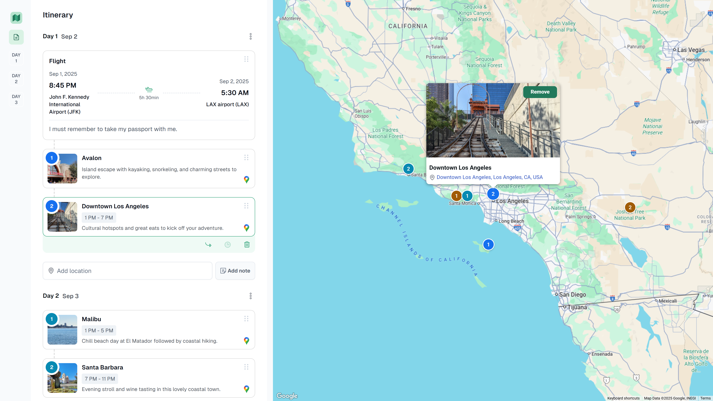

## Triplyfy MCP — Claude Desktop Setup

### What it is
A remote MCP server that lets Claude plan, edit, and save your trips to Triplyfy.

### What is Triplyfy?
A simple trip‑planning app to create and share itineraries. View is public by link, editing requires Google sign‑in. Drag‑and‑drop places and notes across days, see everything on a map, and add flights.

### How to install (Claude Desktop)
Open Claude Desktop → Settings → Developer → MCP Servers → Add server

- Name: `Triplyfy`
- MCP SSE endpoint: `https://triplyfy.com/mcp/sse`

On first connect, you’ll be prompted to sign in with Google and approve access. No manual gateway run is required.

### How it works (short)
- Claude opens Google sign‑in (OAuth) on first connect.
- Claude exchanges a code for a Triplyfy session token (~30 days).
- The token only authenticates your requests from Claude to Triplyfy.
- The server performs only actions you ask (create/read/update trips, search flights).

### Links & Contact
- Website: https://triplyfy.com/
- Email: kirill2003de@gmail.com

